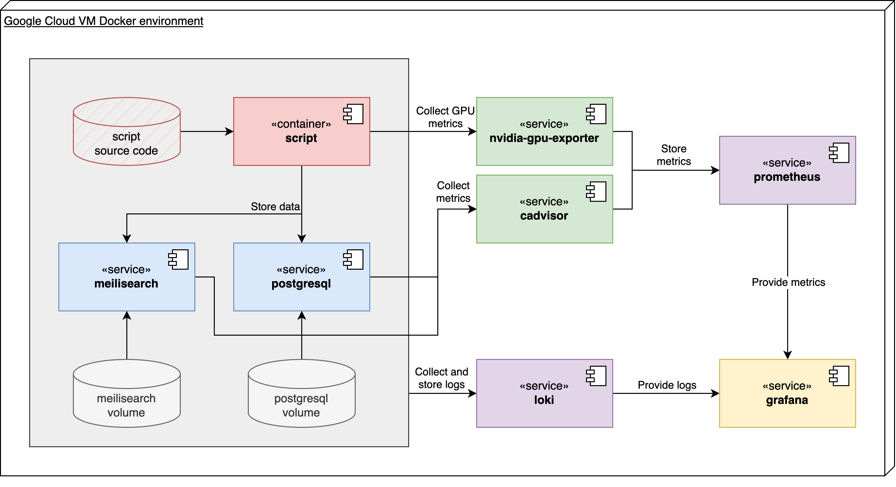

# From Trigrams to Transformers and AI: Semantic and Multilingual Search

This repository contains a series of scripts and Python notebooks needed for the practical implementation of my bachelor thesis.

The project compares traditional trigram-based information retrieval with modern transformer-based semantic search, using multilingual embeddings. It evaluates these methods for academic document retrieval across multiple languages (English, Slovak, German) and varying content granularities (pages, paragraphs, sentences).

---

## Features

- Python scripts and notebooks used for building a custom dataset.
- Baseline trigram-based search utilizing PostgreSQL and `pg_trgm` extension.
- Semantic search using transformer-based text-embeddings models:
  - `multilingual-e5-large-instruct`
  - `gte-multilingual-base`
  - `labse`
- Performance and resource monitoring of the experiment script, PostgreSQL and Meilisearch Docker containers via a simple but powerful monitoring stack: `cadvisor, nvidia_gpu_exporter, prometheus, loki, grafana`

## Dataset

For a fair comparison, a custom dataset was constructed, built on top of 396 academic publications in Slovak, German, and English.

- **Summary generation:** summaries generated using OpenAI’s GPT-4o-mini.
- **Query generation:** 500 search queries generated and translated into target languages using DeepL.
- **Relevance judgments:** generated using LLM-based processing.

## Project structure

```txt
src/
│── dataset_construction/
│   ├── helpers/
│   │   ├── merge-datasets.py                 # If there are multiple metadata.json files, this creates a merged one
│   │   ├── normalize-dataset.py              # If PDF files are spread across multiple directories, this brings them into a shared one
│   │   └── stats.ipynb                       # Scripts to print dataset stats - language distribution, lengths...
│   │
│   └── openai/
│       ├── 00_clean-up.ipynb                 # Removes missing metadata-pdf pairs
│       ├── 01_summaries.ipynb                # Used for generating summaries using OpenAI API
│       ├── 02_queries.ipynb                  # Used for query generation based on summaries
│       ├── 03_queries-translation.ipynb      # Translation of generated queries using DeepL API
│       ├── 04_judgments.ipynb                # Relevance judgments generation scripts
│       └── helpers.ipynb                     # Helper scripts to clean up OpenAI resources
│
│── text_extractor/
│   ├── main.py                 # Text extractor entrypoint
│   ├── extractor.py            # Core extractor logic
│   └── pdftotext.sh            # Used to convert PDF files into raw text before further processing by the extractor ^
│
│── trigram/
│   ├── helpers/                # Helper functions
│   ├── 01_setup.py             # Configures the database, creates tables, indexes...
│   ├── 02_1_index_docs.py      # Seeds document metadata
│   ├── 02_2_index_parts.py     # Seeds document contents using selected text granularity level
│   ├── 03_search.py            # Performs search with multithreading
│   ├── 04_teardown.py          # Drops all tables
│   └── Dockerfile              # Dockerfile to create PostgreSQL image with pg_trgm extension
│
│── meilisearch/
│   ├── lib/                    # Helper functions and abstractions
│   ├── 01_setup.py             # Configures Meilisearch and embedders, creates indexes...
│   ├── 02_embed_and_seed.py    # Computes embeddings and seeds the indexes
│   └── 03_search.py            # Performs multithreaded search
│
│── evaluation/
│   ├── threshold.ipynb         # Used to calculate PostgreSQL trigram threshold values to limit number of results
│   ├── results.ipynb           # Notebook to evaluate obtained results and construct charts and tables
│   └── performance.ipynb       # Notebook to scrape, analyze and plot and visualize performance metrics from Prometheus
│
└── colbert/
    ├── lib/                    # Helper functions
    ├── 00_prepare.py           # Preprocesses the dataset into format that best fits with colbert workflow
    ├── 01_index.py             # Seeds the internal database
    └── 02_search.py            # Performs search

data/
│── dataset/                    # Dataset constructed using OpenAI ChatGPT 4o-mini model
│   ├── 01_summaries.json       # Summaries for each document
│   ├── 02_queries-DE.json      # 500 search queries in German
│   ├── 02_queries-EN.json      # 500 search queries in English
│   ├── 02_queries-SK.json      # 500 search queries in Slovak
│   └── 03_judgements.json      # Relevance judgments
│
│── document_parts/
│   └── json/
│       └── *.json              # Separate JSON file for each document containing its contents as pages, paragraphs and sentences
│
│── library                     # Base collection of scientific publications
│   ├── metadata.json           # Document metadata (id, title, filename)
│   ├── _metadata.json          # Document metadata before clean up
│   └── pdfs
│       └── *.pdf               # PDF file for each scientific publication
│
│── perf
│   └── *.json                  # Performance metrics dump at specified time
│
└── retrieval
    └── */                      # Each retrieval approach in its own directory (trgm, e5, labse and gte)
        └── *.json              # Retrieved documents for each combination of granularity level and query language

conf/
│── dashboard.json              # Grafana dashboards config
│── datasources.yml             # Default Grafana datasources config
│── default.yml                 # Default Grafana dashboard config
│── loki.yml                    # Loki log storage configuration
│── postgresql.conf             # PostgreSQL config used in experiments
│── prometheus.yml              # Prometheus scraper config

diagrams/                       # PlantUML and DrawIO source files used in bachelor thesis document

.gitignore                      # List of files to be ignored by git

.env.sample                     # Example .env file

.dockerignore                   # List of files to be ignored by docker build command
docker-compose.yml              # Docker compose file to start all of the necessary services
Dockerfile                      # Dockerfile to build experiment script container with required libraries preinstalled

requirements.txt                # Required Python libraries
```

## Installation

### Prerequisites

- Docker
- Python 3.9
- Nvidia GPU (for embedding computations)

### Setup and usage

#### 1. Clone and cd into the repository.

```bash
git clone https://github.com/milanmarcinco/bachelor.git
cd multilingual-academic-search
```

#### 2. Create and activate a virtual Python environment.

```bash
python -m venv env

# macos/linux
source ./env/bin/activate
```

#### 3. Install necessary libraries.

```bash
pip install -r requirements.txt
```

##### Used libraries:

- `sentence_transformers` - Framework for computing embeddings using transformer models.
- `meilisearch` - Python client for Meiliseach API.
- `python-dotenv` - Reads key-value pairs from a .env file.
- `openai` - Official Python library for the OpenAI API.
- `deepl` - Official Python library for the DeepL API.
- `psycopg2_binary` - Python PostgreSQL database adapter.
- `requests` - Simple HTTP library.
- `pandas` - Library for data analysis and statistics.
- `matplotlib` - Plotting library.
- `langdetect` - For detecting document language.

- `colbert-ai, torch, faiss-gpu, numpy<2` - Main and supporting libraries for ColBERTv2.

4. Create an `.env` file with secrets according to `.env.sample`.

#### Dataset construction

To construct the dataset yourself, a base dataset (located in `data/library/`) is required. This step primarily uses interactive Python notebooks that can be run sequentially, located in `src/dataset_construction/openai`, with a few helper scripts in the `helpers` directory, if needed. The output of individual steps will be saved in `data/dataset/` directory.

#### Running experiments

The script container itself does not contain the source code in its internal filesystem. Rather, only required libraries are pre-installed inside the image to avoid performance bottlenecks, and source code is available via a mounted volume. This allows you to modify the source code without rebuilding the Docker image each time.

To try out the experiment, follow the steps below.

1. Edit the `RUN_COMMAND` variable in the `.env` file, specifying path to a script in either `src/trigram/` or `src/meilisearch/` directories. This command runs on script container startup.

2. Use `docker compose up -d` to spin up a PostgreSQL and Meilisearch instances, along with the monitoring stack. The script container will be terminated after the specified command successfully terminates.

#### Evaluation

After you have constructed the dataset and ran desired experiments, its output is saved in the `data/retrieval/` directory. Now, you can evaluate the obtained results in one of the evaluation Python notebooks in `src/evaluation`.

## Deployment structure

Entire experiment ran on a Google Cloud VM using 8x G2 vCPUs, 32GB of memory, and a single Nvidia Tesla L4 GPU.

<div style="background: white; padding: 16px 16px 8px 16px; border-radius: 6px;">
  
</div>

## Future development

### Use a different AI model for dataset construction

To do this, simply add a new directory with your scripts inside `src/dataset_construction/` folder.

### Use a different text embedding model

To extend the experiment with a new embedding model, edit the `src/meilisearch/lib/conf.py` file.

## Acknowlegment

This project has been supervised by PaedDr. Pavol Baťalík and Ing. Jakub Dubec, whose guidance and ideas have been extremely valuable throughout the development.
